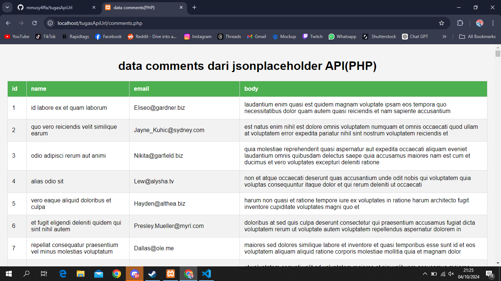

PRAKTIKUM API PHP
 pertama membuat code php seperti digambar
 lalu menambahkan kode html untuk menampilkan data dalam table dan juga menambahkan sedikit css didalamnya
 hasil setelah semua selesai akan seperti ini

setelah itu mencoba untuk method menggunakan JS  agar berhasil, sebelumnya harus menginstall axios dan express
 ini untuk tampilan dari js

TUGAS PRAKIKUM API
 disini saya menambahkan beberapa <th> yaitu nama dan email
 lalu sistem akan menampilkan email yang tercantum

 untuk penggunaan filter sedikit ditambahkan kode php dan html seperti digambar
 setelah selesai maka akan seperti ini dan filter bisa menggunakan nama atau id, dan juga keduanya

)menambahkan sedikit kode css agar terlihat menarik
